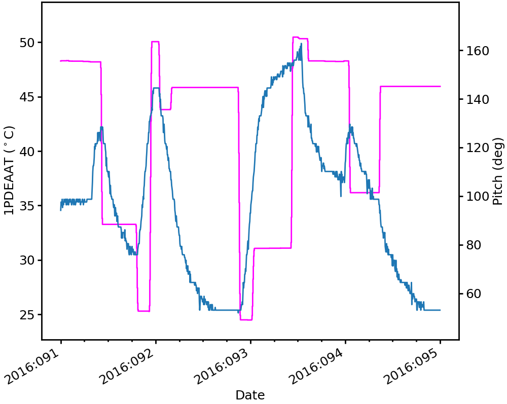
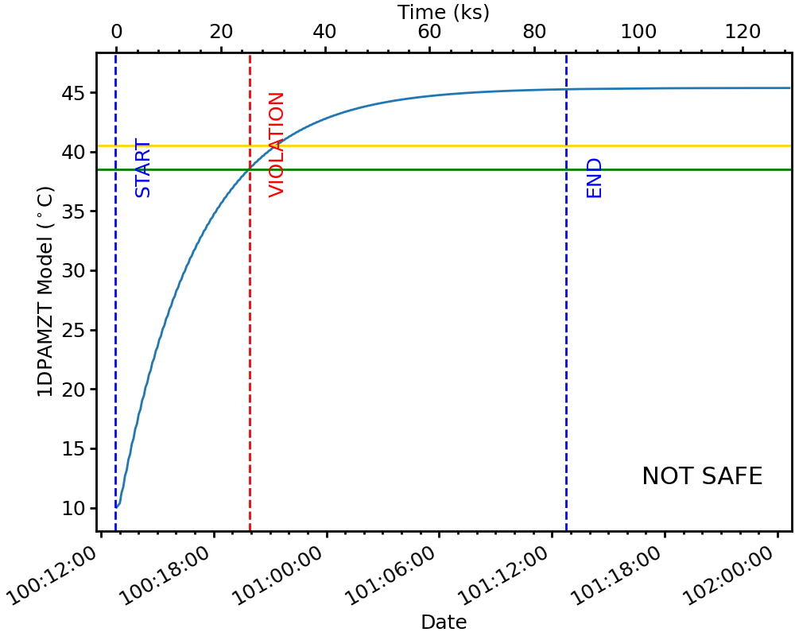
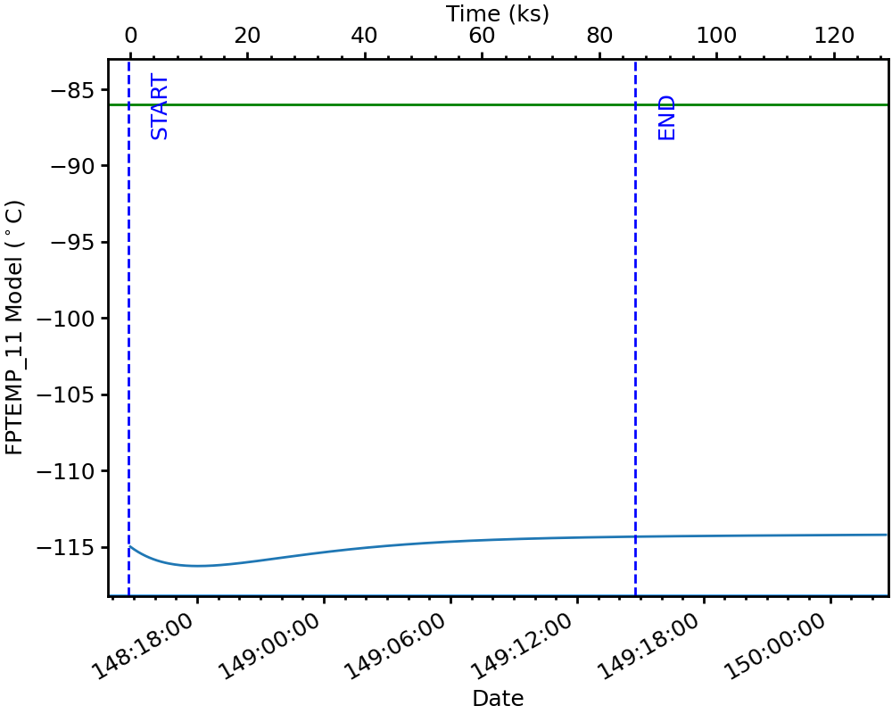
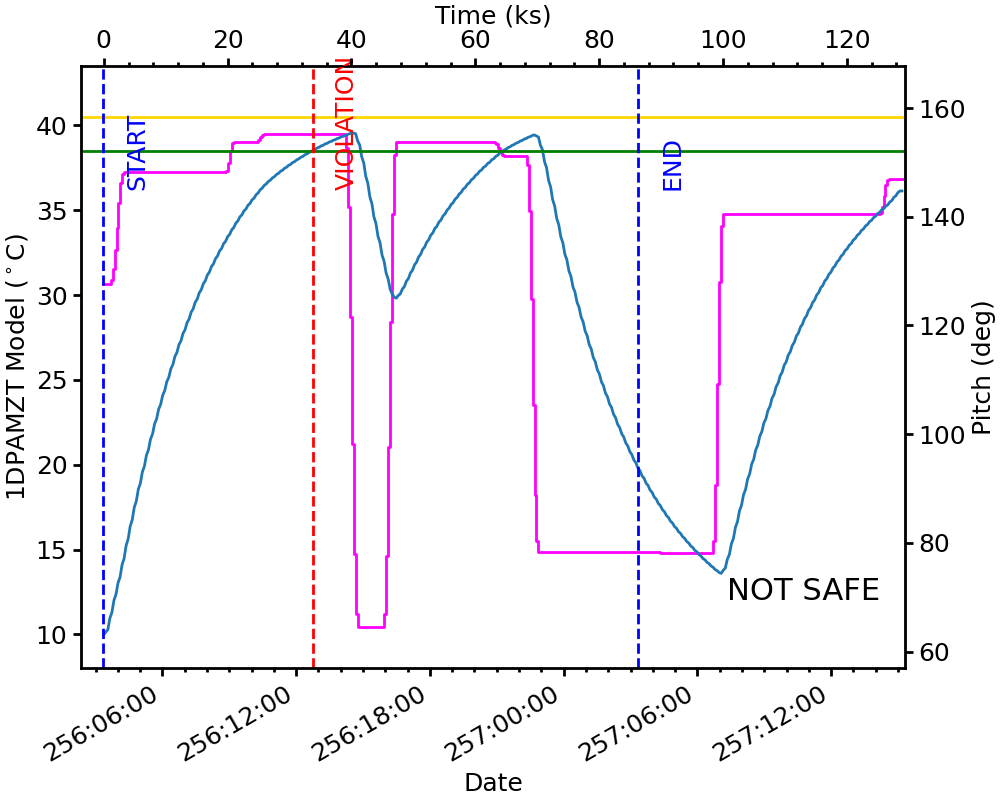

.. acispy_tasks documentation master file, created by
   sphinx-quickstart on Wed Jul 29 15:06:17 2020.
   You can adapt this file completely to your liking, but it should at least
   contain the root `toctree` directive.

ACISpy Command Line Tools
=========================

For making quick plots and getting quick summaries of important information, the 
following ACISpy-based command-line utilities are provided. For finer-grained 
control over plots and data, it is recommended to use the ACISpy Python interface.

Activating
----------

The ACISpy command-line tools are installed into the ACIS Ops Ska Python stack. 
If you are logged on as ``acisdude``, all you need to do is issue the 
command ``acisska`` and this Python stack and the tools will be loaded into 
your environment. 

However, if you would like activate this stack and these tools from your own user
account, add the following alias to your ``.bashrc`` if you are using the Bash
shell (or a variant):

.. code-block:: bash

   alias acisska='eval "$(/data/acis/mambaforge/bin/conda shell.zsh hook)"; \
                  export SKA=/proj/sot/ska; \
                  conda activate ska'

Or, if you are a mascohist or are otherwise compelled to use the C shell or a 
variant of it, add this alias to your ``.cshrc.user``:

.. code-block:: bash

   alias acisska 'source /data/acis/mambaforge/etc/profile.d/conda.csh; \
                  setenv SKA /proj/sot/ska; \
                  conda activate ska'

.. warning::

    The ACIS Ops Ska Python stack should be used in a "clean" terminal window 
    where you are not trying to do anything else (i.e., load reviews, SACGS) 
    as setting up the Ska environment messes with environment variables and paths. 

``multiplot_archive``
---------------------

.. code-block:: text

   usage: multiplot_archive [-h] [--one-panel] [--maude] tstart tstop plots
   
   Make plots of MSIDs and commanded states from the engineering archive
   
   positional arguments:
     tstart       The start time in YYYY:DOY:HH:MM:SS format
     tstop        The stop time in YYYY:DOY:HH:MM:SS format
     plots        The MSIDs and states to plot, comma-separated
   
   options:
     -h, --help   show this help message and exit
     --one-panel  Whether to make a multi-panel plot or a single-panel plot. 
                  The latter is only valid if the quantities have the same units.
     --maude      Use MAUDE to get telemetry data.

Example 1
+++++++++

.. code-block:: bash

    [~]$ multiplot_archive 2016:089 2016:091 1deamzt,1dpamzt,ccd_count
    
Returns:

Example 2
+++++++++

.. code-block:: bash

    [~]$ multiplot_archive 2016:091 2016:097 1pdeaat,1pdeabt --one-panel

``multiplot_tracelog``
----------------------

.. code-block:: text

   usage: multiplot_tracelog [-h] [--one-panel] tracelog plots
   
   Make plots of MSIDs from a tracelog file. Commanded states will be loaded 
   from the commanded states database.
   
   positional arguments:
     tracelog     The tracelog file to load the MSIDs from
     plots        The MSIDs and states to plot, comma-separated
   
   options:
     -h, --help   show this help message and exit
     --one-panel  Whether to make a multi-panel plot or a single-panel plot. 
                  The latter is only valid if the quantities have the same units.

Example 1
+++++++++

.. code-block:: bash
    
    [~]$ multiplot_tracelog acisENG10d_01252205181.50.tl 1pdeaat,1dp28avo,simpos
    
Returns:

Example 2
+++++++++

.. code-block:: bash
    
    [~]$ multiplot_tracelog acisENG10d_01252205181.50.tl 1dp28avo,1dp28bvo --one-panel
    
Returns:

``plot_10day_tl``
-----------------

.. code-block:: text

   usage: plot_10day_tl [-h] [--days DAYS] [--one-panel] fields
   
   Plot one or more MSIDs or states from the ACIS 10-day tracelog files.
   
   positional arguments:
     fields       The MSIDs and states to plot, comma-separated
   
   options:
     -h, --help   show this help message and exit
     --days DAYS  The number of days before the end of the log to plot. Default: 10
     --one-panel  Whether to make a multi-panel plot or a single-panel plot. 
                  The latter is only valid if the quantities have the same units.

Example 1
+++++++++

Plot one MSID and two states in three different panels.

.. code-block:: bash

    [~]$ plot_10day_tl 1pdeaat,pitch,off_nom_roll

Returns:

Example 2
+++++++++

Plot 3 MSIDs from ove the past three days and combine them in one panel.

.. code-block:: bash

    [~]$ plot_10day_tl 1dpamzt,tmp_fep1_mong,tmp_bep_pcb --days 3 --one-panel

Returns:

``plot_model``
--------------

.. code-block:: text

   usage: plot_model [-h] [--y2_axis Y2_AXIS] load y_axis
   
   Plot a single model component with another component or state
   
   positional arguments:
     load               The load to take the model from
     y_axis             The model component to plot on the left y-axis
   
   options:
     -h, --help         show this help message and exit
     --y2_axis Y2_AXIS  The model component or state to plot on the right y-axis
                        (default: none)

Example
+++++++

.. code-block:: bash

    [~]$ plot_model MAR0716A 1dpamzt --y2_axis=off_nom_roll
    
Returns:

``plot_msid``
-------------

.. code-block:: text

   usage: plot_msid [-h] [--y2_axis Y2_AXIS] [--maude] tstart tstop y_axis
   
   Plot a single MSID with another MSID or state
   
   positional arguments:
     tstart             The start time in YYYY:DOY:HH:MM:SS format
     tstop              The stop time in YYYY:DOY:HH:MM:SS format
     y_axis             The MSID to be plotted on the left y-axis
   
   options:
     -h, --help         show this help message and exit
     --y2_axis Y2_AXIS  The MSID or state to be plotted on the right y-axis
                        (default: none)
     --maude            Use MAUDE to get telemetry data.

Example
+++++++

Plot 1PDEAAT and pitch. 

.. code-block:: bash

    [~]$ plot_msid 2016:091 2016:095 1pdeaat --y2_axis=pitch

Returns:

``simulate_ecs_run``
--------------------

.. code-block:: text

   usage: simulate_ecs_run [-h] component tstart hours T_init attitude ccd_count
   
   Simulate an ECS run.
   
   positional arguments:
     component   The component to model: dpa, dea, psmc, or acisfp
     tstart      The start time of the ECS run in YYYY:DOY:HH:MM:SS format
     hours       The length of the ECS run in hours.
     T_init      The initial temperature of the component in degrees C.
     attitude    The attitude information for the ECS run. One of three possible 
                 formats: pitch,off_nom_roll: 155.0,2 .0; quaternion: 1.0,0.3,0.0,0.0; 
                 a string named: vehicle
     ccd_count   The number of CCDs to clock.
   
   options:
     -h, --help  show this help message and exit

Example 1
+++++++++

To run the 1DPAMZT model with the following conditions:

* Start time: 2015:100:12:45:30
* Length of ECS run: 24 hours
* Initial temperature: 10.0 degrees C
* Pitch: 150 degrees
* CCD count: 6
* Off-nominal roll: 12.0 degrees

.. code-block:: bash

    [~]$ simulate_ecs_run dpa 2015:100:12:45:30 24 10.0 150.0,12.0 6

Returns:

.. code-block:: text

   acispy: [INFO     ] 2024-09-11 12:05:55,344 Using model for dpa from chandra_models version = 3.54
   Fetching msid: aoeclips over 2015:100:12:22:16.816 to 2015:102:01:05:20.816
   acispy: [INFO     ] 2024-09-11 12:05:55,540 Run Parameters
   acispy: [INFO     ] 2024-09-11 12:05:55,540 --------------
   acispy: [INFO     ] 2024-09-11 12:05:55,540 Modeled Temperature: 1dpamzt
   acispy: [INFO     ] 2024-09-11 12:05:55,540 Start Datestring: 2015:100:12:45:30.000
   acispy: [INFO     ] 2024-09-11 12:05:55,540 Length of state in hours: 24.0
   acispy: [INFO     ] 2024-09-11 12:05:55,540 Stop Datestring: 2015:102:00:45:30.000
   acispy: [INFO     ] 2024-09-11 12:05:55,540 Initial Temperature: 10.0 degrees C
   acispy: [INFO     ] 2024-09-11 12:05:55,540 CCD/FEP Count: 6
   acispy: [INFO     ] 2024-09-11 12:05:55,540 Pitch: 150.0
   acispy: [INFO     ] 2024-09-11 12:05:55,540 Off-nominal Roll: 12.0
   acispy: [INFO     ] 2024-09-11 12:05:55,540 Detector Housing Heater: OFF
   acispy: [INFO     ] 2024-09-11 12:05:55,541 Model Result
   acispy: [INFO     ] 2024-09-11 12:05:55,541 ------------
   acispy: [INFO     ] 2024-09-11 12:05:55,542 The limit of 38.5 degrees C will be reached at 2015:100:19:56:00.816, after 25.830815999984743 ksec.
   acispy: [INFO     ] 2024-09-11 12:05:55,542 The limit is reached before the end of the observation.
   acispy: [WARNING  ] 2024-09-11 12:05:55,542 This observation is NOT safe from a thermal perspective.
   /Users/jzuhone/mambaforge/envs/ska-dev/lib/python3.11/site-packages/Ska/Matplotlib/core.py:151: UserWarning: This figure was using a layout engine that is incompatible with subplots_adjust and/or tight_layout; not calling subplots_adjust.
     fig.autofmt_xdate()
   acispy: [INFO     ] 2024-09-11 12:05:55,935 Image of the model run has been written to ecs_run_1dpamzt_6chip_2015:100:12:45:30.png.

Example 2
+++++++++

To run the ACIS focal plane model with the following conditions:

* Start time: 2020:148:14:45:00
* Length of ECS run: 24 hours
* Initial temperature: -115.0 degrees C
* Quaternion: [-0.04470333, 0.63502552, -0.67575906, 0.37160988]
* CCD count: 4

Note that in this case we specify an attitude quaternion for an accurate representation
of the Earth solid angle.

.. code-block:: bash

    [~]$ simulate_ecs_run acisfp 2020:148:14:45:00 24 -115.0 -0.04470333,0.63502552,-0.67575906,0.37160988 4

Returns:

.. code-block:: text

   acispy: [INFO     ] 2024-09-11 12:04:21,413 Using model for acisfp from chandra_models version = 3.54
   acispy: [WARNING  ] 2024-09-11 12:04:21,477 Using quaternions to calculate pitch and roll because both were not specified in the states.
   Fetching msid: aoeclips over 2020:148:14:22:22.816 to 2020:150:03:05:26.816
   acispy: [INFO     ] 2024-09-11 12:04:22,418 Run Parameters
   acispy: [INFO     ] 2024-09-11 12:04:22,418 --------------
   acispy: [INFO     ] 2024-09-11 12:04:22,418 Modeled Temperature: fptemp_11
   acispy: [INFO     ] 2024-09-11 12:04:22,418 Start Datestring: 2020:148:14:45:00.000
   acispy: [INFO     ] 2024-09-11 12:04:22,418 Length of state in hours: 24.0
   acispy: [INFO     ] 2024-09-11 12:04:22,418 Stop Datestring: 2020:150:02:45:00.000
   acispy: [INFO     ] 2024-09-11 12:04:22,418 Initial Temperature: -115.0 degrees C
   acispy: [INFO     ] 2024-09-11 12:04:22,418 CCD/FEP Count: 4
   acispy: [INFO     ] 2024-09-11 12:04:22,418 Quaternion: [-0.04470333, 0.63502552, -0.67575906, 0.37160988]
   acispy: [INFO     ] 2024-09-11 12:04:22,418 Pitch: 155.13828486037553
   acispy: [INFO     ] 2024-09-11 12:04:22,418 Off-nominal Roll: 10.637704660891393
   acispy: [INFO     ] 2024-09-11 12:04:22,418 Detector Housing Heater: OFF
   acispy: [INFO     ] 2024-09-11 12:04:22,418 Model Result
   acispy: [INFO     ] 2024-09-11 12:04:22,418 ------------
   acispy: [INFO     ] 2024-09-11 12:04:22,419 The focal plane is never cold for this ECS measurement.
   acispy: [INFO     ] 2024-09-11 12:04:22,419 The limit of -86.0 degrees C is never reached.
   acispy: [INFO     ] 2024-09-11 12:04:22,793 Image of the model run has been written to ecs_run_fptemp_11_4chip_2020:148:14:45:00.png.

Example 3
+++++++++

This example assumes that the vehicle loads are still running, which means that 
the attitude information comes from a load.

To run the 1DPAMZT model with the following conditions:

* Start time: 2017:256:03:20:00 
* Length of ECS run: 24 hours
* Initial temperature: 10.0 degrees C
* CCD count: 6
* Using attitude profile from vehicle loads

.. code-block:: bash

    [~]$ simulate_ecs_run dpa 2017:256:03:20:00 24 10.0 vehicle 6

Returns:

.. code-block:: text

   acispy: [INFO     ] 2024-09-11 11:56:19,994 Modeling a 6-chip state concurrent with states from the following vehicle loads: {'SEP0917C', 'SEP1317B'}
   acispy: [INFO     ] 2024-09-11 11:56:20,932 Using model for dpa from chandra_models version = 3.54
   Fetching msid: aoeclips over 2017:256:02:54:54.816 to 2017:257:15:37:58.816
   acispy: [INFO     ] 2024-09-11 11:56:21,145 Run Parameters
   acispy: [INFO     ] 2024-09-11 11:56:21,145 --------------
   acispy: [INFO     ] 2024-09-11 11:56:21,145 Modeled Temperature: 1dpamzt
   acispy: [INFO     ] 2024-09-11 11:56:21,145 Start Datestring: 2017:256:03:20:00.000
   acispy: [INFO     ] 2024-09-11 11:56:21,145 Length of state in hours: 24.0
   acispy: [INFO     ] 2024-09-11 11:56:21,145 Stop Datestring: 2017:257:15:20:00.000
   acispy: [INFO     ] 2024-09-11 11:56:21,145 Initial Temperature: 10.0 degrees C
   acispy: [INFO     ] 2024-09-11 11:56:21,145 CCD/FEP Count: 6
   acispy: [INFO     ] 2024-09-11 11:56:21,145 Detector Housing Heater: OFF
   acispy: [INFO     ] 2024-09-11 11:56:21,146 Model Result
   acispy: [INFO     ] 2024-09-11 11:56:21,146 ------------
   acispy: [INFO     ] 2024-09-11 11:56:21,147 The limit of 38.5 degrees C will be reached at 2017:256:12:45:18.816, after 33.918815999984744 ksec.
   acispy: [INFO     ] 2024-09-11 11:56:21,147 The limit is reached before the end of the observation.
   acispy: [WARNING  ] 2024-09-11 11:56:21,147 This observation is NOT safe from a thermal perspective.
   acispy: [INFO     ] 2024-09-11 11:56:21,838 Image of the model run has been written to ecs_run_1dpamzt_6chip_2017:256:03:20:00.png.

``phase_scatter_plot``
----------------------

.. code-block:: text

   usage: phase_scatter_plot [-h] [--c_field C_FIELD] [--cmap CMAP] 
          [--maude] tstart tstop x_field y_field
   
   Make a phase scatter plot of one MSID or state versus another within 
   a certain time frame.
   
   positional arguments:
     tstart             The start time in YYYY:DOY:HH:MM:SS format
     tstop              The stop time in YYYY:DOY:HH:MM:SS format
     x_field            The MSID or state to plot on the x-axis
     y_field            The MSID or state to plot on the y-axis
   
   options:
     -h, --help         show this help message and exit
     --c_field C_FIELD  The MSID or state to plot using colors
     --cmap CMAP        The colormap to use if plotting colors
     --maude            Use MAUDE to get telemetry data.
    
Example 1
+++++++++

.. code-block:: bash

    [~]$ phase_scatter_plot 2017:100 2017:200 1deamzt 1dpamzt

Returns:

Example 2
+++++++++

.. code-block:: bash

    [~]$ phase_scatter_plot 2017:100 2017:200 1deamzt 1dpamzt --c_field ccd_count --cmap=jet

Returns:

``phase_histogram_plot``
------------------------

.. code-block:: text

   usage: phase_histogram_plot [-h] [--scale SCALE] [--cmap CMAP] [--maude] 
          tstart tstop x_field y_field x_bins y_bins
   
   Make a phase plot of one MSID or state versus another within a certain time frame.
   
   positional arguments:
     tstart         The start time in YYYY:DOY:HH:MM:SS format
     tstop          The stop time in YYYY:DOY:HH:MM:SS format
     x_field        The MSID or state to plot on the x-axis
     y_field        The MSID or state to plot on the y-axis
     x_bins         The number of bins on the x-axis
     y_bins         The number of bins on the y-axis
   
   options:
     -h, --help     show this help message and exit
     --scale SCALE  Use linear or log scaling for the histogram, default 'linear'
     --cmap CMAP    The colormap for the histogram, default 'hot'
     --maude        Use MAUDE to get telemetry data.
       usage: phase_histogram_plot [-h] [--scale SCALE] [--cmap CMAP] [--maude]
                                   tstart tstop x_field y_field x_bins y_bins

Example
+++++++

.. code-block:: bash

    [~]$ phase_histogram_plot 2017:100 2017:200 1deamzt 1dpamzt 40 40 --scale=log --cmap=hsv

Returns:

